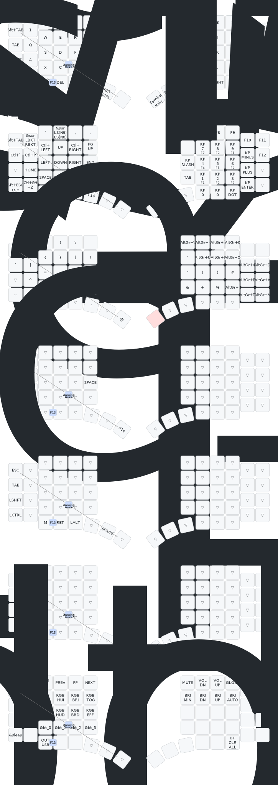

# go60-zmk-config

ZMK firmware configuration for the MoErgo Go60 split keyboard.

## Building and Flashing

### Quick start

```bash
./flash.sh          # build + flash both halves
./flash.sh --no-build   # flash using an existing go60.uf2
```

`flash.sh` builds the firmware, then walks you through flashing each half. Put each side into bootloader mode when prompted; the script detects the USB drive automatically. If a half is already in bootloader mode it skips the wait and flashes immediately.

### Build only

```bash
./build.sh          # uses go60-main branch of mgabor3141/zmk
./build.sh some-tag # uses a specific branch or tag
```

The build runs inside Docker using the official `zmkfirmware/zmk-build-arm:4.1` image. The ZMK source and west modules are stored in the `go60-zmk-src` Docker volume; build artifacts go in `go60-build-cache`. First build fetches everything (~5 min); subsequent builds recompile only what changed.

### Build cache

To force a fully clean build:

```bash
docker volume rm go60-zmk-src go60-build-cache
```

### Firmware fork

This config builds against [mgabor3141/zmk:go60-main](https://github.com/mgabor3141/zmk/tree/go60-main), a minimal fork of upstream `zmkfirmware/zmk:main` (Zephyr 4.1) that adds:

- Go60 board definition (ported to Zephyr 4.1 board structure)
- RH thumb pixel-lookup fix
- petejohanson's [cirque-input-module](https://github.com/petejohanson/cirque-input-module) for trackpad z-min filtering (Zephyr 4.1's built-in driver lacks this, causing phantom touch events)

### Repository structure

```
config/
  go60.keymap      # keymap definition
  go60.conf        # kconfig options
build.sh           # builds firmware inside Docker, outputs go60.uf2
flash.sh           # builds + flashes both halves via USB bootloader
Dockerfile         # build environment
```

---

## Layout



The diagram above is regenerated on every push by the `Draw keymap` workflow using [keymap-drawer](https://github.com/caksoylar/keymap-drawer).

## Layout Notes

I designed this layout with a few goals in mind, in order of priority:

1. Comfortable symbol layout for programming
2. Reduce needing to move the right hand from the mouse when not typing (e.g. only to press enter)
3. No significant departure from row staggered: switching to a laptop keyboard should be effortless
4. Standardize hotkey muscle memory across macOS and Linux
5. Eliminate needing to switch keyboard layouts to type non-English characters

### No home row modifiers

Home row mods are great for mostly-keyboard workflows where you can always press modifiers with the opposite hand. For workflows with significant mouse usage, HRMs don't make sense in my opinion.

### Ctrl and Cmd

I use Linux naming throughout. When I write "Ctrl" I mean the "secondary" modifier: Ctrl on Linux, Command on Mac.

Making the two equivalent is not quite as simple as swapping them based on the OS. See my dotfiles for more detail:
https://github.com/mgabor3141/dots/blob/main/.docs/keyboard-remapping.md

### Left hand can hotkey (almost) everything

With the placement of Ctrl and Shift, the most common hotkeys can all be typed with just the left hand. Alt is also on the left side. This complements the Nav layer, which is activated from a thumb key, making the left half a powerful hotkey system on its own.

### Window management

The window manager key (Super on Linux, Ctrl on Mac) is positioned to take maximum advantage of the left half. I use WM+ESDF for directional window switching (workspaces up/down, scrolling windows left/right). Adding the pinky Shift turns focus actions into window moves.

The remaining keys are a mix of resizing, floating toggle, and direct workspace activation. I use Niri and Aerospace for window management:
- https://github.com/mgabor3141/dots/tree/main/dot_config/aerospace
- https://github.com/mgabor3141/dots/blob/main/dot_config/niri/config.kdl

### Other details

- The Nav layer's right half fits a full numpad.
- Symbol layer includes locale-specific keys on the right side, so no layout switching is needed.
- Gaming layer removes tap-holds for consistent behavior. The alpha layer stays unmodified for alt-tabbing and chat. WASD games should be rebound to ESDF.
- Caps word key, because everyone should have one.
- Semicolon and colon are swapped; I don't program in languages that mandate semicolons.
- Mouse 4 and 5 are mapped to the outer reach keys on the base layer. Pressing both is a global mic mute.
