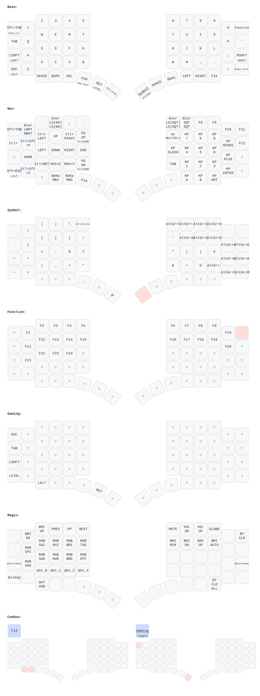

# go60-zmk-config

A custom ZMK keymap and firmware configuration for the MoErgo Go60 split keyboard.

## TL;DR

- The layout prioritizes programming symbols, one-handed shortcuts while using a mouse, and consistent macOS/Linux muscle memory.
- See the rendered keymap below; edit `config/go60.keymap` to customize it.
- Run `./flash.sh` to build and flash both halves.
- Builds use Docker and a pinned, reviewed Go60 ZMK fork.

## Keymap



The diagram is regenerated on every push by the `Draw keymap` workflow using [keymap-drawer](https://github.com/caksoylar/keymap-drawer). The source of truth is [`config/go60.keymap`](config/go60.keymap).

### Design goals

I designed this layout with a few goals in mind, in order of priority:

1. Comfortable symbol layout for programming
2. Reduce needing to move the right hand from the mouse when not typing, for example only to press Enter
3. No significant departure from row staggered, so switching to a laptop keyboard remains effortless
4. Standardize hotkey muscle memory across macOS and Linux
5. Eliminate needing to switch keyboard layouts to type non-English characters

### No home row modifiers

Home row mods are great for mostly-keyboard workflows where modifiers can always be pressed with the opposite hand. They make less sense to me for workflows with significant mouse usage.

### Ctrl and Cmd

I use Linux naming throughout. When I write “Ctrl,” I mean the secondary modifier: Ctrl on Linux and Command on macOS.

Making the two equivalent is not quite as simple as swapping them based on the OS. See [my keyboard-remapping notes](https://github.com/mgabor3141/dots/blob/main/.docs/keyboard-remapping.md) for more detail.

### Left-hand shortcuts

The placement of Ctrl and Shift allows the most common shortcuts to be typed with only the left hand. Alt is also on the left side. This complements the thumb-activated Nav layer, making the left half a powerful shortcut system on its own.

### Window management

The window-manager key—Super on Linux and Ctrl on macOS—is positioned to take maximum advantage of the left half. I use WM+ESDF for directional window switching: workspaces up/down and scrolling windows left/right. Adding the pinky Shift turns focus actions into window moves.

The remaining keys cover resizing, floating toggle, and direct workspace activation. I use:

- [AeroSpace](https://github.com/mgabor3141/dots/tree/main/dot_config/aerospace) on macOS
- [Niri](https://github.com/mgabor3141/dots/blob/main/dot_config/niri/config.kdl) on Linux

### Other details

- The Nav layer’s right half fits a full numpad.
- The Symbol layer includes locale-specific keys on the right, avoiding layout switching.
- The Gaming layer removes tap-holds for consistent behavior. The alpha layer remains unmodified for alt-tabbing and chat. WASD games should be rebound to ESDF.
- There is a Caps Word key, because everyone should have one.
- Semicolon and colon are swapped; I do not program in languages that mandate semicolons.
- Mouse 4 and 5 are mapped to the outer reach keys on the base layer. Pressing both is a global microphone mute.

---

## Building and flashing

### Quick start

```bash
./flash.sh             # build and flash both halves
./flash.sh --no-build  # flash the existing go60.uf2
```

`flash.sh` builds the firmware and then walks through flashing each half. Put each side into bootloader mode when prompted; the script detects the USB drive automatically. If a half is already in bootloader mode, it skips the wait and flashes immediately.

### Build only

```bash
./build.sh                # use the pinned, reviewed firmware revision
./build.sh some-revision  # override it with a commit, branch, or tag
```

The build runs inside Docker using the official `zmkfirmware/zmk-build-arm:4.1` image. ZMK and its west modules are stored in the `go60-zmk-src` Docker volume, while build artifacts go in `go60-build-cache`. The first build fetches everything and takes roughly five minutes; subsequent builds recompile only what changed.

Each build restores and deterministically prepares the conflicting Zephyr and external Cirque driver files, so reusing the source volume does not accumulate patches.

### Build cache

To force a fully clean build:

```bash
docker volume rm go60-zmk-src go60-build-cache
```

### Firmware fork

This config pins reviewed commit [`eca8146653f9`](https://github.com/mgabor3141/zmk/commit/eca8146653f9c8075b20e4b570e1bbae10151368) from [mgabor3141/zmk:go60-main](https://github.com/mgabor3141/zmk/tree/go60-main), a minimal fork of upstream `zmkfirmware/zmk:main` on Zephyr 4.1. It adds:

- A Go60 board definition ported to the Zephyr 4.1 board structure
- The right-hand thumb pixel-lookup fix
- [petejohanson’s cirque-input-module](https://github.com/petejohanson/cirque-input-module) for trackpad Z-min filtering, which Zephyr 4.1’s built-in driver lacks

## Repository structure

```text
config/
  go60.keymap      # keymap definition
  go60.conf        # Kconfig options
build.sh           # build in Docker and output go60.uf2
flash.sh           # build and flash both halves via the USB bootloader
Dockerfile         # build environment
scripts/prepare-west-tree.sh # deterministic shared source preparation
```
